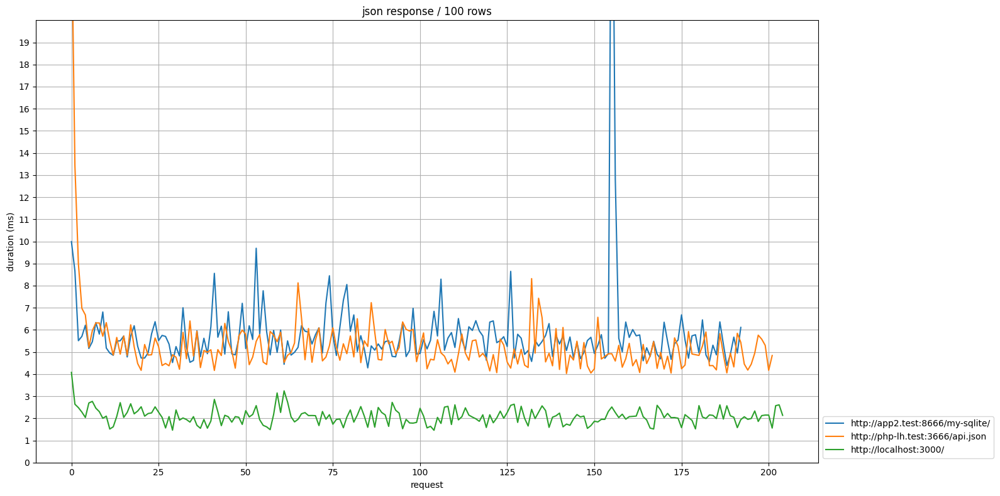
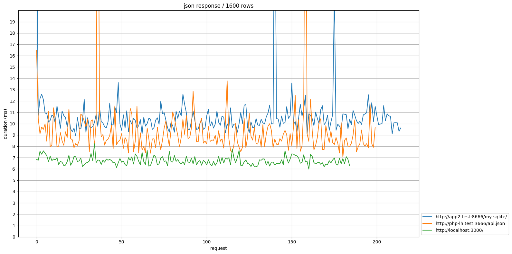

# Performances

* About same performance
  * Nginx + PHP built-in server
  * Nginx + PHP-FPM
* local Fastify is faster but growing fast with the number of rows

* About the same performance for 1600+ rows
  * Nginx + PHP-FPM
  * Nginx + PHP built-in server
  * Fastify localhost

